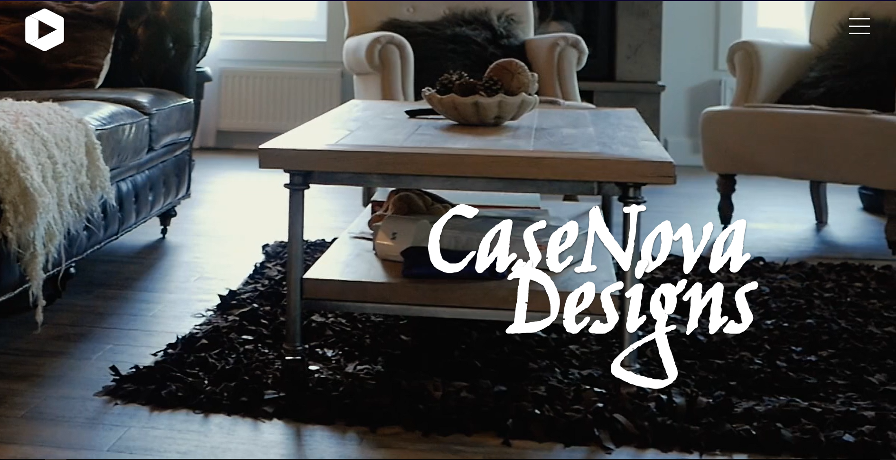

# Coders-Explorer

our site link -- https://himanshu12145.github.io/Coders-Explorer/

## Hi, 
   welcome to our project [CasaNova Designs ](https://himanshu12145.github.io/Coders-Explorer/) themed over **House Application and Furniture** . 
We here tried our best to overcome many kind of situations which we thought could never be resolved at starting point of the project but then gradually we started learning new things and referring to new resources online which are really great and helped us a lot which we are also going to share with you all so be patient and stick with us till end .

### How to run the website
  So, you could also check the deployed version of the website by clicking on [CasaNova Designs ](https://himanshu12145.github.io/Coders-Explorer/)
  To run the website locally you could just clone this repository in your local machine's local repository or just by downloading the zip file . If you downloaded the zip file then first of all extract it then open the root directory named as *Coders-Explorer-main* then inside it just double click on index.js file that will take you to the landing page of out website pretty excited right!
 
 ###Some References 

*Image Resources*

- [Unsplash](https://unsplash.com/)
- [Pexels](https://www.pexels.com/)
- [Pixabay](https://pixabay.com/)
- [Lifeofpix](https://www.lifeofpix.com/)

 *Icon Resources*
 
 - [Font Awesome](https://fontawesome.com/)	
 - [Line Awesome](https://icons8.com/line-awesome)
 - [Material Icons](https://material.io/resources/icons/)	
 - [IonIcons](http://ionicons.com/)	
 - [Zurb Foundation Icons](https://zurb.com/playground/foundation-icon-fonts-3)

*Some JS and CSS Frameworks* 
- [Bootstrap(v5)](https://getbootstrap.com/docs/5.0/getting-started/introduction/)   
- [Animate On Scroll](https://michalsnik.github.io/aos/)   
- [SASS](https://sass-lang.com/)
- [HTML,CSS,JS](https://developer.mozilla.org/)
- [GIT](https://git-scm.com/)

Oh ,really bunch of free resources...

As you all could sense from the name of the website its main theme is design with love. Its really focused over Furniture and other home appliances that are day to day used in our daily life . And you can always watch the preview of our website.

##Preview of our website

### Problems Faced by us
Well, there were really a lot of problems that make us demotivated but at first we just make an layout on just pen and paper then we shared our imagination and then we tried to divide the whole work into many task and that task to many subtasks so that whenever we forget whats the next step at that time just do'nt get stuck . And another point to be noted is that we have a really good coordination as a group which many developers around the world don't tell .

###New things we learned 
There are pretty much many new things that we learnt but the most important thing that we learnt is to understand the mindset of the coder while coding .As we mentioned above those are some of the partially-free resources that we tried to implement in our project. We tried to implement many different libraries in this project and we are furthur thinking of to create a backend for this project like Node, Express MongoDB and many new cool things . And yes That's it you are really taking a lot of new and cool stuff from here just keep on learning from hereon and refer to this whenever needed.   

